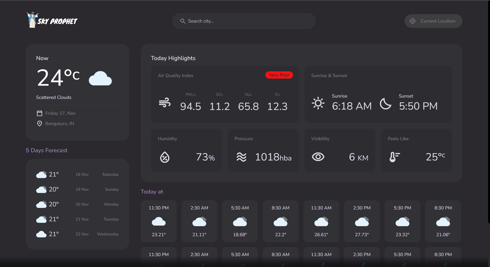
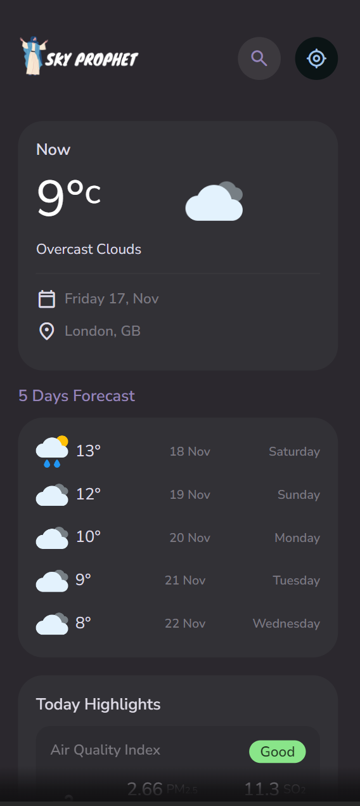

# Sky-Prophet
# DEMO
<video src="Sky%20Project%20Recording.mp4" controls title="Demo"></video>

## Snapshots of the Project

In Mobile:

# HTML

## Slider Item (Lines 355-365)

This section represents a single item in a slider. Each item is a small card that displays some weather information. It includes:

- Wind speed
- Wind direction (represented by an icon)
- Temperature 

## Footer (Lines 368-378)

The footer contains two links:

- A link to the GitHub profile of the developer, represented by a GitHub icon.
- A link to the OpenWeather API, which powers the weather information in the app. This is represented by the OpenWeather icon.

## Loading Screen (Lines 381-382)

This is a loading screen that is displayed while the app fetches data.

## 404 Error Page (Lines 385-392)

This section is displayed when a user navigates to a non-existent page. It contains a message ("Page Not Found!") and a button that redirects the user back to the home page.

# CSS

## Typography Classes (Lines 262-286)

These classes are used to apply different font sizes throughout the application. They use CSS variables for the font sizes, which makes it easy to adjust the typography globally. The classes include:

- `.title-1`: Applies a large font size, typically used for main headings.
- `.title-2`: Applies a medium font size, typically used for subheadings. It also adds a bottom margin.
- `.title-3`: Applies a small font size, typically used for tertiary headings. It also applies a semi-bold font weight.
- `.body-1`, `.body-2`, `.body-3`: These classes are used for different levels of body text, with `.body-1` being the largest and `.body-3` being the smallest. `.body-2` also applies a semi-bold font weight.
- `.label-1`, `.label-2`: These classes are used for label text, with `.label-1` being larger than `.label-2`.

## Header Styles (Lines 291-299)

These styles are specific to the header of the application:

- `.header .btn-primary .span`: Hides the span element inside a button with the class `.btn-primary` in the header.
- `.logo img`: Sets the width of the logo image in the header to 150px.
- `.header .container`: No styles are defined for this selector in the provided code.

# API

## Constants (Lines 2)

`api_key` is a constant that holds the API key for the OpenWeatherMap API.

## fetchData Function (Lines 4-8)

`fetchData` is a function that fetches data from a given URL and then calls a callback function with the fetched data. It uses the Fetch API to make the HTTP request and expects the response to be in JSON format.

## url Object (Lines 10-28)

`url` is an object that contains methods for generating URLs for different types of weather data:

- `currentWeather(lat, lon)`: Returns a URL for fetching the current weather data for a given latitude and longitude.
- `forecast(lat, lon)`: Returns a URL for fetching the weather forecast for a given latitude and longitude.
- `airPollution(lat, lon)`: Returns a URL for fetching the air pollution data for a given latitude and longitude.
- `reverseGeo(lat, lon)`: Returns a URL for performing a reverse geocoding lookup for a given latitude and longitude.
- `geo(query)`: Returns a URL for performing a geocoding lookup for a given query string. The query string can be a city name, for example.

# app.js

## Air Quality Index Card (Lines 137-174)

This section of the code creates a card that displays the Air Quality Index (AQI) and the levels of various pollutants. It uses data fetched from the `airPollution` object.

- `main :{aqi}`: This is the overall AQI.
- `components: {no2, o3, so2, pm2_5}`: These are the levels of various pollutants. `no2` is nitrogen dioxide, `o3` is ozone, `so2` is sulfur dioxide, and `pm2_5` is particulate matter less than 2.5 micrometers in diameter.

The card is created using the `createElement` method and the `innerHTML` property. It includes:

- A heading ("Today Highlights").
- A list of pollutants, each with its level and a label.
- A badge that displays the AQI level and a message related to the AQI. The message is fetched from `module.aqiText[aqi].message` and the level is fetched from `module.aqiText[aqi].level`.

The card is then added to the `highlight-list` div.

# module.js

## Constants (Lines 2-19)

`weekDayNames` and `monthNames` are arrays that hold the names of the days of the week and the months of the year, respectively. They are used to convert date numbers into more human-readable formats.

## getDate Function (Lines 22-31)

`getDate` is a function that takes a Unix timestamp and a timezone offset (both in seconds), and returns a string representing the date in the format "WeekDayName MonthName, Date" (e.g., "Sunday 10, Jan").

The function works as follows:

1. It creates a new Date object using the provided Unix timestamp and timezone offset.
2. It gets the day of the week and the month from the Date object using the `getUTCDay` and `getUTCMonth` methods, respectively.
3. It uses these values to look up the corresponding day and month names in the `weekDayNames` and `monthNames` arrays.
4. It gets the day of the month from the Date object using the `getUTCDate` method.
5. It constructs and returns a string using these values.

# route.js

## IP and Location Fetching (Lines 7-14)

This section fetches the user's IP address from the "https://api.ipify.org" API and then uses that IP address to fetch the user's location from the "https://ipinfo.io" API. The latitude and longitude are extracted from the location data and used to update the weather information.

## Current Location Function (Lines 16-23)

This function uses the Geolocation API to get the user's current location. The latitude and longitude are extracted from the location data and used to update the weather information. If the location cannot be fetched, the user is redirected to the approximate location page.

## Searched Location Function (Line 24)

This function takes a query string, splits it into latitude and longitude, and uses them to update the weather information.

## Routes (Lines 25-28)

This is a map of routes. Each route is associated with a function that is called when the route is accessed.

## Check Hash Function (Lines 29-33)

This function checks the current URL hash and calls the associated function from the routes map. If the route does not exist in the map, it calls the `error404` function.

## Event Listeners (Lines 34-41)

These event listeners call the `checkHash` function when the URL hash changes and when the page loads. If the page is loaded without a hash, the user is redirected to the current location page.